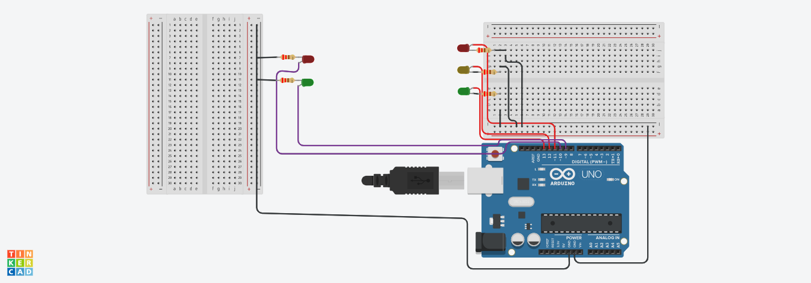
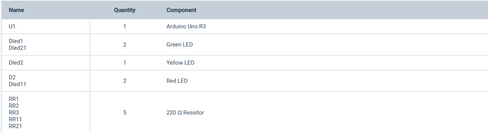

# Play-on-Arduino
Here will be projects for Arduino when make, enjoy repository that!
<h1>Project Traffic Light</h1>
<figure>
  
</figure>

On project have two traffic light, one is only for pedestrians, the
insight of when turn on led for example red on traffic
light main in your right side, our pedestrian traffic light, led green 
of your left side turn. nice, right? details, all this automatic!

<h1>List of Materials</h1>
<figure>
  
</figure>

You can to use the Tinkercad for make code or direct on IDE of Arduino for when
to use yourself Arduino hardware.

<h1>How will this work?</h1>

Only take code that traffic_light and put on Tikercad or try doing upload for your IDE of Arduino

